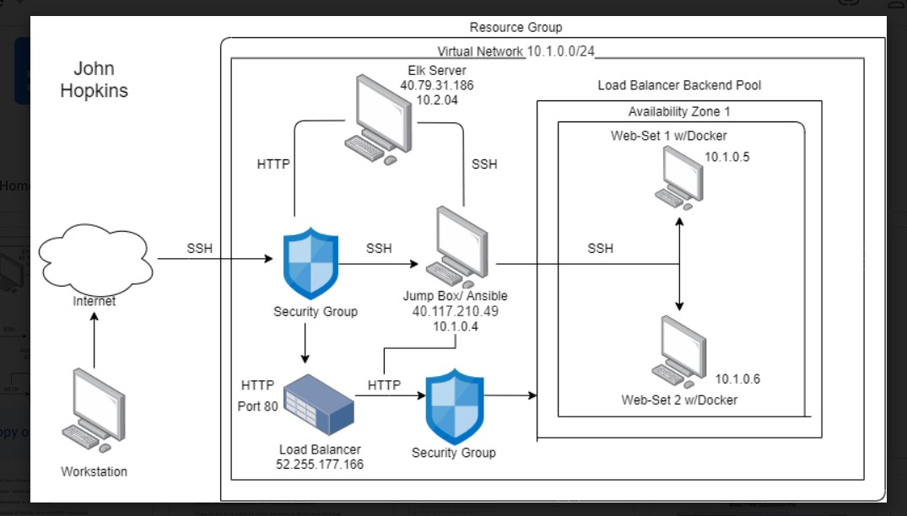
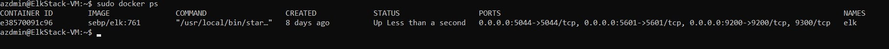
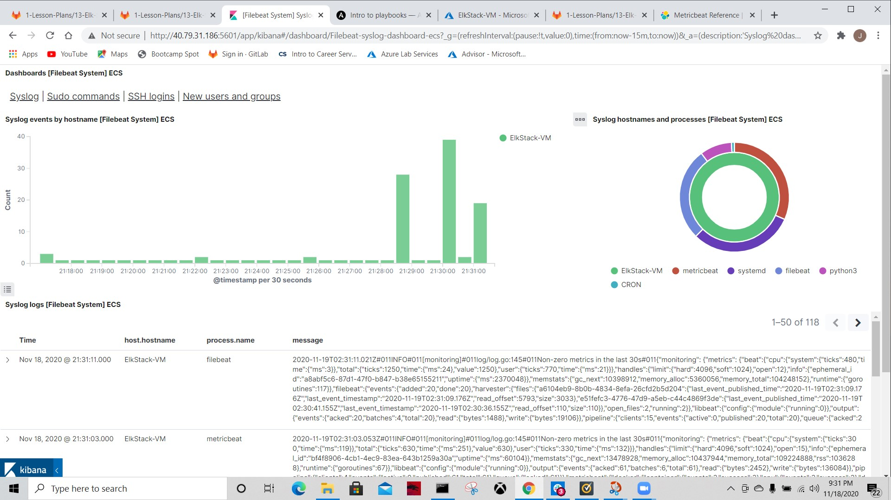
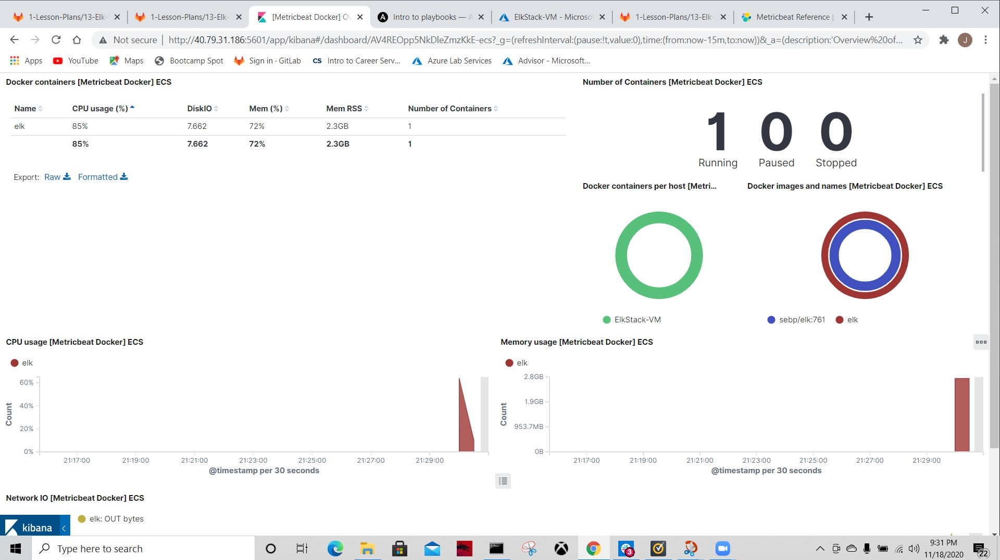

# Week13-Project1-JohnH
## Automated ELK Stack Deployment

The files in this repository were used to configure the network depicted below.



These files have been tested and used to generate a live ELK deployment on Azure. They can be used to either recreate the entire deployment pictured above. Alternatively, select portions of the Playbook file may be used to install only certain pieces of it, such as Filebeat.

```yml
---
- name: Installing and launching filebeat
  hosts: elk
  become: yes
  tasks:

    # Use command module
  - name: Download filebeat deb
    command: curl -L -O https://artifacts.elastic.co/downloads/beats/filebeat/filebeat-7.6.1-amd64.deb

    # Use command module
  - name: Install filebeat deb
    command: dpkg -i filebeat-7.6.1-amd64.deb

    # Use copy module
  - name: Drop in filebeat.yml
    copy:
      src: /etc/ansible/files/filebeat-config.yml
      dest: /etc/filebeat/filebeat.yml
 
    # Use command module
  - name: Enable and configure system module
    command: filebeat modules enable logstash

    # Use command module
  - name: Setup filebeat
    command: filebeat setup

    # Use command module
  - name: Start filebeat service
    command: sudo service filebeat start
  ```

This document contains the following details:
- Description of the Topology
- Access Policies
- ELK Configuration
  - Beats in Use
  - Machines Being Monitored
- How to Use the Ansible Build


### Description of the Topology

The main purpose of this network is to expose a load-balanced and monitored instance of DVWA, the Damn Vulnerable Web Application.

Load balancing ensures that the application will be highly Available, in addition to restricting Traffic to the network.
  
  What aspect of security do load balancers protect? What is the advantage of a jump box?

-  Load Balancing is an important security role as computing moves more to the cloud. The off-loading function of a load balancer defends an organization against distributed denial-of-service (DDoS) attacks. It does this by shifting attack traffic from the corporate server to a public cloud provider.

-  A Jump Box is used to control the access to other machines that its connected to by allowing specific IP addresses to connect it, then it forwards those connections to their designated machines.

Integrating an ELK server allows users to easily monitor the vulnerable VMs for changes to the Logs and system Traffic.
- What does Filebeat watch for? Filebeat is used for forwarding and centralizing log data. Installed as an agent on your servers, Filebeat monitors the log files or locations that you specify, collects log events, and forwards them either to Elasticsearch or Logstash for indexing.

- What does Metricbeat record? Metricbeat can be installed on your servers to periodically collect metrics from the operating system and from services running on the server. Metricbeat takes the metrics and statistics that it collects and ships them to the output that you specify, such as Elasticsearch or Logstash.

The configuration details of each machine may be found below.
Note: Use the [Markdown Table Generator](http://www.tablesgenerator.com/markdown_tables) to add/remove values from the table.

| Name     | Function  | IP Address | Operating System |   |
|----------|-----------|------------|------------------|---|
| Jump Box | Gateway   | 10.1.0.4   | Linux            |   |
| Web-1    | Webserver | 10.1.0.5   | Linux            |   |
| Web-2    | Webserver | 10.1.0.6   | Linux            |   |
| ELK-VM   | Webserver | 10.2.0.4   | Linux            |   |

### Access Policies

The machines on the internal network are not exposed to the public Internet. 

Only the Jump-Box-Provisioner machine can accept connections from the Internet. 

Access to this machine is only allowed from the following IP addresses:
- 73.12.XX.XXX/32

Machines within the network can only be accessed by SSH.
- Which machine did you allow to access your ELK VM? Jump-Box-Provisioner.
  
- What was its IP address? 40.117.210.49

A summary of the access policies in place can be found in the table below.

| Name     | Publicly Accessible | Allowed IP Address |   |
|----------|---------------------|--------------------|---|
| Jump Box | Yes                 | 73.12.XX.XXX/32    |   |
| Web-1    | No                  | 10.1.0.5           |   |
| Web-2    | No                  | 10.1.0.6           |   |
| ELK-VM   | No                  | 10.2.0.4           |   |

### Elk Configuration

Ansible was used to automate configuration of the ELK machine. No configuration was performed manually, which is advantageous because...
- What is the main advantage of automating configuration with Ansible? Automating with Ansible allows you create consistent, reproducable results throughout multiple machine configurations.

The playbook implements the following tasks:

In 3-5 bullets, explain the steps of the ELK installation play. E.g., install Docker; download image; etc.
- Install docker.io
- Install python3.pip
- Install docker module
- Increase virtual memory
- Use more memory

The following screenshot displays the result of running `docker ps` after successfully configuring the ELK instance.



### Target Machines & Beats
This ELK server is configured to monitor the following machines:

List the IP addresses of the machines you are monitoring:
- Web-1: 10.1.0.5
- Web-2: 10.1.0.6
- Elk: 10.2.0.4

We have installed the following Beats on these machines:
  Specify which Beats you successfully installed:
- Filebeat
- Metricbeat

These Beats allow us to collect the following information from each machine:
  
  In 1-2 sentences, explain what kind of data each beat collects, and provide 1 example of what you expect to see. E.g., `Winlogbeat` collects Windows logs, which we use to track user logon events, etc.

-  Filebeat monitors the log files or locations that you specify, such as Syslogs, shown by Kibana below.


  
-  Metricbeat: Metricbeat monitors the metrics and statistics of the operating system, such as CPU usage, shown by Kibana below.


  

### Using the Playbook
In order to use the playbook, you will need to have an Ansible control node already configured. Assuming you have such a control node provisioned: 

SSH into the control node and follow the steps below:
- Copy the yml file to ansible folder.
- Update the config file to include remote users, host ip address, and published ports.
- Run the playbook, and navigate to the Kibana to check that the installation has worked as expected.

Answer the following questions to fill in the blanks:
- Which file is the playbook? .yml file
- Where do you copy it? /etc/ansible, /etc/ansible/files, and /etc/ansible/roles depending on the .yml file.
- Which file do you update to make Ansible run the playbook on a specific machine? /etc/ansible/hosts and /etc/ansible/ansible.cfg.
- How do I specify which machine to install the ELK server on versus which to install Filebeat on? You can specify which machine by editing the /etc/ansible/hosts file with the approriate IP addresses.
- Which URL do you navigate to in order to check that the ELK server is running?
  http://<local.host>:5601/app/kibana#/home
  
_As a **Bonus**, provide the specific commands the user will need to run to download the playbook, update the files, etc._

- nano /etc/ansible/ansible.cfg
- nano /etc/ansible/hosts
- ansible all -m ping
- nano <your-playbook.yml>
- ansible-playbook <your-playbook.yml>
- ssh ansible@<XX.X.X.X>
- curl <local.host>/setup.php

